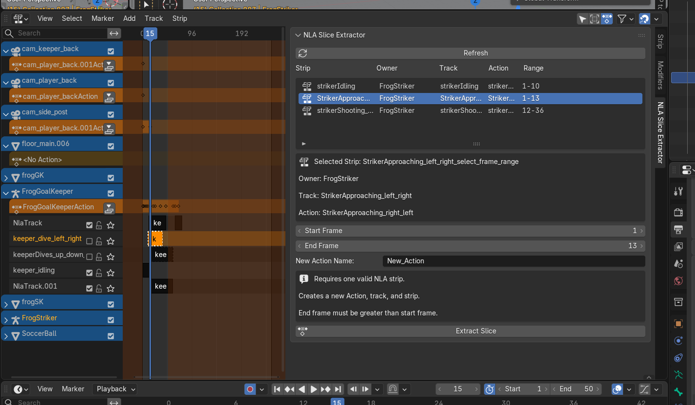

# NLA Slice Extractor

Extract a chosen frame range from a selected NLA (Nonlinear action) strip into a new independent Action, then automatically create a new NLA track and strip from that slice.

## Overview

**NLA Slice Extractor** is a Blender add-on for cutting useful animation segments out of longer NLA strips.

It is designed for workflows such as:

- splitting a longer animation into reusable clips
- isolating walk, run, jump, or attack sections from one larger sequence
- preparing separate animation clips for export to Unreal Engine
- refining or testing smaller motion segments without destroying the original strip

Instead of manually rebuilding an animation segment from scratch, you select an existing NLA strip, choose a frame range, and extract that slice into its own reusable action and strip.

## What the add-on does

When you click **Extract Slice**, the add-on:

1. Uses the selected NLA strip as the source
2. Extracts only the chosen frame range
3. Preserves the visible motion at the cut boundaries
4. Creates a **new independent Action**
5. Creates a **new NLA track**
6. Creates a **new NLA strip** on that new track
7. Names the new track and new strip using the **new action name**
8. Places the new strip at the same timeline position as the extracted frame range
9. Leaves the original strip untouched

## Features

- Refresh and display all available NLA strips from the relevant animated owner
- Show strip details clearly in the UI
- Extract a chosen frame range from a selected strip
- Create boundary keys at the slice limits so the extracted motion matches the source
- Automatically generate:
  - a new Action
  - a new NLA track
  - a new NLA strip
- Keep the original strip unchanged

## Screenshot

## Location

Open Blender and go to:

**NLA Editor → Sidebar → NLA Slice Extractor**

## How to use

1. Select the animated object, armature, or driven mesh you want to work with.
2. Open the **NLA Editor**.
3. Open the **NLA Slice Extractor** panel in the sidebar.
4. Click **Refresh** to update the list of strips.
5. Select the strip you want to slice.
6. Set:
   - **Start Frame**
   - **End Frame**
   - **New Action Name**
7. Click **Extract Slice**.

## Example workflow

Imagine you animated a character with multiple motions in one longer sequence:

- Walk: frames `1–40`
- Run: frames `41–80`
- Jump: frames `81–120`

You can use **NLA Slice Extractor** to:

- extract frames `1–40` into `Walk`
- extract frames `41–80` into `Run`
- extract frames `81–120` into `Jump`

Each one becomes:

- its own Action
- its own NLA track
- its own NLA strip

That makes the clips easier to edit, reuse, and export separately.

## Important notes

### Refresh updates the strip list

The add-on uses a **Refresh** button to rebuild the strip list safely and consistently.

If the strip list does not match what you expect in the NLA editor:

- select the correct object
- click **Refresh**
- then select the strip from the updated list

### End frame must be greater than start frame

The selected range must cover more than one frame.

### The original strip is not modified

The source strip remains unchanged. The add-on creates a new extracted result instead of replacing or overwriting the original data.

### The result appears immediately in NLA

The add-on does not stop at creating an Action datablock. It also creates:

- a new NLA track
- a new strip on that track
  so the result is visible and usable right away.

## Good use cases

- Splitting a long character animation into separate motion clips
- Organizing animation libraries
- Preparing clean animation clips for engine export
- Testing isolated motion sections
- Reusing parts of existing animation without rebuilding them

## Current scope

This version is focused on one clear job:

- slice one selected NLA strip
- create one new reusable result

It does **not** currently include:

- multi-strip extraction at once
- automatic clip detection
- marker-based slicing
- retiming tools
- direct export features
- action cleanup beyond the extracted slice itself

## Tips

- Use clear action names such as:
  - `Walk`
  - `Run`
  - `Jump`
  - `Attack_01`
- Refresh the list after moving strips between tracks
- Keep your source strip intact so you can extract multiple clips from the same animation
- Use the resulting strips to prepare clean exports for external engines like Unreal

## 

## License

GPL-3.0-or-later

## 
